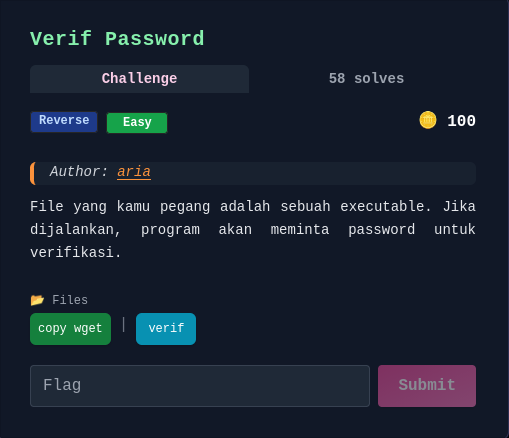
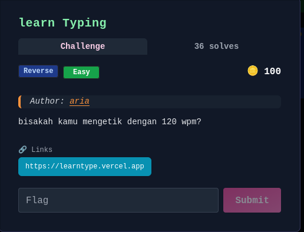
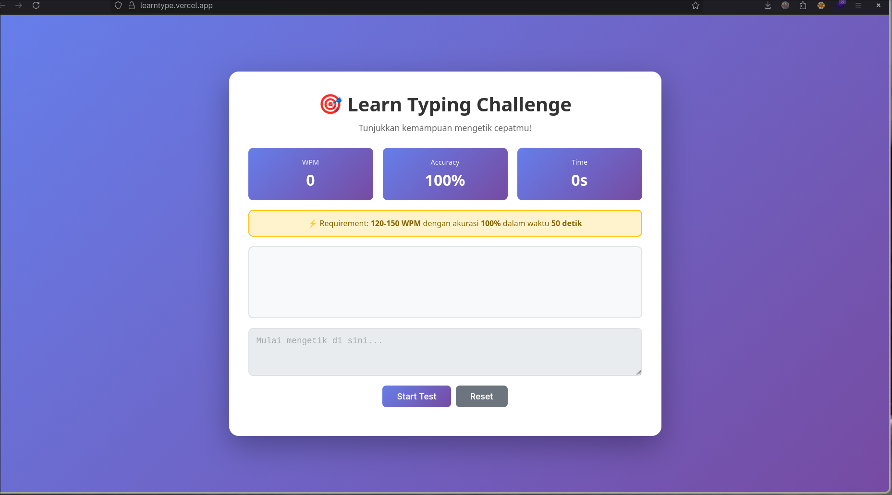
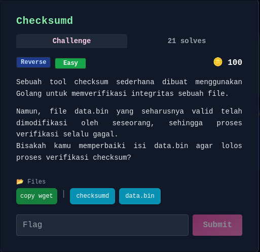
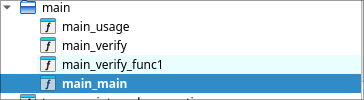

# Write up CTF ARIAF

Saya lagi belajar pwn dan rev bang ijin nulis **write up**


## rev :
- [Leaky Login](#leaky-login) | [Solved]
- [question](#question) | [Solved]
- [Verif Password](#verif-password) | [Solved]
- [Learn Typing](#learn-typing) | [Solved]
- [Checksumd](#checksumd) | [Solved]
- [Silent Checksum](#silent-checksum) | [Solved]
- [Activation](#activation)
- [Dompet Crypto 2011](#dompet-crypto-2011)

### Leaky login

```
λ ~/Leaky_Login/ main* ./leaky_login              
Login
Username: adit
Password: adit
Login failed.

λ ~/Leaky_Login/ main* file leaky_login                         
leaky_login: ELF 64-bit LSB pie executable, x86-64, version 1 (SYSV), dynamically linked, interpreter /lib64/ld-linux-x86-64.so.2, BuildID[sha1]=a9a0577dc79bf017d1d0f7302c5a7c8aaaa4d1b3, for GNU/Linux 3.2.0, not stripped

λ ~/Leaky_Login/ main* strings leaky_login          
/lib64/ld-linux-x86-64.so.2
0,Z|
mfUa
__cxa_finalize
fgets
strcspn
__libc_start_main
strcmp
puts
strstr
strlen
stdin
snprintf
stderr
fwrite
__stack_chk_fail
libc.so.6
GLIBC_2.4
GLIBC_2.2.5
GLIBC_2.34
_ITM_deregisterTMCloneTable
__gmon_start__
_ITM_registerTMCloneTable
PTE1
u+UH
{"user":"admin","pass":"letmein123","flag":"FGTE{REVERSE_LOGIN_LEAK}"}
"%s":"
user
pass
flag
Internal error: bad embedded creds JSON
Login
Username: 
Password: 
Welcome %s!
Flag: %s
Login failed.
:*3$"
GCC: (Ubuntu 11.4.0-1ubuntu1~22.04.2) 11.4.0
Scrt1.o
__abi_tag
crtstuff.c
deregister_tm_clones
__do_global_dtors_aux
completed.0
__do_global_dtors_aux_fini_array_entry
frame_dummy
__frame_dummy_init_array_entry
leaky_login.c
creds_json
extract_value
__FRAME_END__
_DYNAMIC
__GNU_EH_FRAME_HDR
_GLOBAL_OFFSET_TABLE_
__libc_start_main@GLIBC_2.34
_ITM_deregisterTMCloneTable
puts@GLIBC_2.2.5
stdin@GLIBC_2.2.5
_edata
_fini
strlen@GLIBC_2.2.5
__stack_chk_fail@GLIBC_2.4
snprintf@GLIBC_2.2.5
strcspn@GLIBC_2.2.5
fgets@GLIBC_2.2.5
__data_start
strcmp@GLIBC_2.2.5
__gmon_start__
__dso_handle
_IO_stdin_used
_end
__bss_start
main
fwrite@GLIBC_2.2.5
__TMC_END__
_ITM_registerTMCloneTable
__cxa_finalize@GLIBC_2.2.5
_init
strstr@GLIBC_2.2.5
stderr@GLIBC_2.2.5
.symtab
.strtab
.shstrtab
.interp
.note.gnu.property
.note.gnu.build-id
.note.ABI-tag
.gnu.hash
.dynsym
.dynstr
.gnu.version
.gnu.version_r
.rela.dyn
.rela.plt
.init
.plt.got
.plt.sec
.text
.fini
.rodata
.eh_frame_hdr
.eh_frame
.init_array
.fini_array
.dynamic
.data
.bss
.comment

λ ~/Leaky_Login/ main* ./leaky_login
Login
Username: admin
Password: letmein123
Welcome admin!
Flag: FGTE{REVERSE_LOGIN_LEAK}

```
- Cuman saya strings flagnya udah terlihat, mungkin bagi kalian yang gatau apa gunanya perintah strings, jadi perintah itu bisa melihat string yang pastinya wkwk, bisa juga memahami logika berdasarkan output kalo output berupa strings, mengindentifikasi library dan fungsi kalo binarynya ga di strip.
### Flag: FGTE{REVERSE_LOGIN_LEAK}


### question


```
λ ~/question/ main* ./quiz_2     
Quiz Verification
Answer all questions correctly to see the flag.
Welcome to quiz verification. You will be asked 10 questions.
(Seed: 1768824056)
Q1: 14 * 3 = ?
42
Q2: 42 - 9 = ?
33
Q3: 15 % 37 = ?
15
Q4: 80 - 41 = ?
39
Q5: 29 - 34 = ?
-5
Q6: 71 - 14 = ?
57
Q7: 1 + 21 = ?
22
Q8: 33 - 25 = ?
8
Q9: 99 + 20 = ?
119
Q10: 48 - 25 = ?
23
Good. Here's the flag: FGTE{Hidden_Math_Flag}
λ ~/question/ main* 
```
- Okey dari sini emang keluar sih flagnya masa soalnya cuma matematika, nah saya berasumsi kalo soalnya ini harus langsung ngeluarin flag atau di otomasi programnya biar ga perlu ngitung, cape jir bolak balik kalkulator :v. 


- okey program sudah saya patching biar langsung muntahin flag, sekarang saya jelasin apa yang saya lakukan
`wx e904000000 @ 0x00001140`
- Dari 0x1140 lompat ke 0x1149
- kode di bawah ini bakalan dilewatin
```
call fcn.00001350
test eax, eax   
je fail            
```

`pd 7 @ 0x0000113b`
- saya minta tampilkan 7 instruksi dari alamat tersebut
`0x1140  e904000000  jmp 0x1149`
- artinya patching berhasil

```
__int64 __fastcall main(int a1, char **a2, char **a3)
{
  puts("Quiz Verification");
  puts("Answer all questions correctly to see the flag.");
  if ( (unsigned int)sub_1350("Answer all questions correctly to see the flag.", a2) )
    sub_1260();
  else
    puts("Verification failed. Try again.");
  return 0;
}
```
- Masalahnya: **sub_1350()** selalu dieksekusi
- Flag function **sub_1260** hanya di panggil disaat kondisi terpenuhi

```
__int64 __fastcall sub_1350()
{
  __int64 v0; // rbx
  unsigned int v1; // r13d
  char *v2; // rbp
  unsigned int v3; // r12d
  unsigned int v4; // edx
  __int64 v5; // r12
  int v6; // r15d
  int v7; // eax
  int v8; // r8d
  int v9; // ecx
  int v10; // esi
  int v12; // [rsp+4h] [rbp-A4h]
  int v13; // [rsp+8h] [rbp-A0h]
  int v14; // [rsp+Ch] [rbp-9Ch]
  char v15; // [rsp+10h] [rbp-98h] BYREF
  unsigned __int64 v16; // [rsp+68h] [rbp-40h]

  v1 = 1;
  v16 = __readfsqword(0x28u);
  v2 = &v15;
  v3 = time(0);
  srand(v3);
  __printf_chk(1, "Welcome to quiz verification. You will be asked %d questions.\n", 10);
  v4 = v3;
  v5 = 1;
  __printf_chk(1, "(Seed: %u)\n", v4);
  while ( 1 )
  {
    v6 = rand() % 100;
    v14 = v6 + 1;
    v13 = rand() % 50;
    v12 = v13 + 1;
    v7 = rand();
    v8 = v13 + 1;
    v9 = v6 + 1;
    v10 = v7 % 4;
    if ( v7 % 4 == 2 )
    {
      v0 = v12 * (__int64)v14;
      __printf_chk(1, "Q%d: %d * %d = ?\n", v5, v9, v8);
    }
    else if ( v10 == 3 )
    {
      v0 = v14 % v12;
      __printf_chk(1, "Q%d: %d %% %d = ?\n", v5, v9, v8);
    }
    else if ( (v7 & 3) != 0 )
    {
      if ( v10 == 1 )
      {
        v0 = v6 - v13;
        __printf_chk(1, "Q%d: %d - %d = ?\n", v5, v9, v8);
      }
    }
    else
    {
      v0 = v14 + v12;
      __printf_chk(1, "Q%d: %d + %d = ?\n", v5, v9, v8);
    }
    if ( (unsigned int)__isoc99_scanf("%ld", v2) != 1 )
      break;
    if ( *(_QWORD *)v2 != v0 )
      v1 = 0;
    ++v5;
    v2 += 8;
    if ( v5 == 11 )
      return v1;
  }
  return 0;
}
```

di sini program menginisialisasi RNG (srand(seed))
Loop 10 kali:
Ambil input user
Bandingkan jawaban
Jika salah → set status gagal

### Flag: FGTE{Hidden_Math_Flag}


### Verif password


```
λ ~/Verif_password/ main* ./verif
Welcome to the verification challenge!
Enter password: aaaa
Wrong password. Try harder!
λ ~/Verif_password/ main* file verif
verif: ELF 64-bit LSB executable, x86-64, version 1 (SYSV), dynamically linked, interpreter /lib64/ld-linux-x86-64.so.2, for GNU/Linux 3.2.0, BuildID[sha1]=f5e4eb9bd95f0a14f41d1ef1a6f8ee703c85a059, stripped
```
- selanjutnya saya strings dulu siapa tau ada sesuatuu hehe :V
```
Failed to read cookie!
calloc
Could not read full TOC!
Error on file.
Failed to extract %s: inflateInit() failed with return code %d!
Failed to extract %s: failed to allocate temporary input buffer!
Failed to extract %s: failed to allocate temporary output buffer!
Failed to extract %s: decompression resulted in return code %d!
Failed to extract %s: failed to open archive file!
Failed to extract %s: failed to seek to the entry's data!
Failed to extract %s: failed to allocate data buffer (%u bytes)!
Failed to extract %s: failed to read data chunk!
Failed to create symbolic link %s!
Failed to extract %s: failed to open target file!
Failed to extract %s: failed to allocate temporary buffer!
Failed to extract %s: failed to write data chunk!
Failed to seek to cookie position!
Could not allocate memory for archive structure!
Could not allocate buffer for TOC!
%s/%s
Py_DecRef
Py_DecodeLocale
Py_Finalize
Py_IsInitialized
Py_PreInitialize
PyInitConfig_Create
PyInitConfig_Free
PyInitConfig_SetInt
PyInitConfig_SetStr
PyInitConfig_SetStrList
PyInitConfig_GetError
Py_InitializeFromInitConfig
PyConfig_Clear
PyConfig_InitIsolatedConfig
PyConfig_Read
PyConfig_SetBytesString
PyConfig_SetString
PyConfig_SetWideStringList
Py_InitializeFromConfig
:
```
- nah dugaan saya benar kalo ini binary python, saya pake less btw kalo ga pake less panjang banget, lebih tepatnya sih ini python yang dikemas menjadi executable menggunakan **PyInstaller**
 - download dulu `wget https://raw.githubusercontent.com/extremecoders-re/pyinstxtractor/master/pyinstxtractor.py`
 - sederhananya gini
 1. verif (Binary mentah) pyinstxtractor​ -> verif.pyc (Bytecode).
 2. chal.pyc pycdc / uncompyle6​ -> Source Code (Python yang bisa dibaca).

 ```
λ ~/ main* python3 pyinstxtractor.py verif                                                                
[+] Processing verif
[+] Pyinstaller version: 2.1+
[+] Python version: 3.10
[+] Length of package: 7739023 bytes
[+] Found 75 files in CArchive
[+] Beginning extraction...please standby
[+] Possible entry point: pyiboot01_bootstrap.pyc
[+] Possible entry point: pyi_rth_inspect.pyc
[+] Possible entry point: chall.pyc
[!] Warning: This script is running in a different Python version than the one used to build the executable.
[!] Please run this script in Python 3.10 to prevent extraction errors during unmarshalling
[!] Skipping pyz extraction
[+] Successfully extracted pyinstaller archive: verif

You can now use a python decompiler on the pyc files within the extracted directory
λ ~/ main* ls
 pyinstxtractor.py   verif   verif_extracted
λ ~/ main* cd verif_extracted                                
λ ~/verif_extracted/ main* ls
 base_library.zip   libbz2.so.1.0    libffi.so.8     libpython3.10.so.1.0   pyiboot01_bootstrap.pyc   pyimod03_ctypes.pyc   PYZ.pyz_extracted
 chall.pyc          libcrypto.so.3   liblzma.so.5    libz.so.1              pyimod01_archive.pyc      python3.10            struct.pyc
 Crypto             libexpat.so.1    libmpdec.so.3   pyi_rth_inspect.pyc    pyimod02_importers.pyc    PYZ.pyz              
λ ~/verif_extracted/ main* pycdc chall.pyc -o source_code.py
λ ~/verif_extracted/ main* ls
 base_library.zip   libbz2.so.1.0    libffi.so.8     libpython3.10.so.1.0   pyiboot01_bootstrap.pyc   pyimod03_ctypes.pyc   PYZ.pyz_extracted
 chall.pyc          libcrypto.so.3   liblzma.so.5    libz.so.1              pyimod01_archive.pyc      python3.10            source_code.py
 Crypto             libexpat.so.1    libmpdec.so.3   pyi_rth_inspect.pyc    pyimod02_importers.pyc    PYZ.pyz               struct.pyc
 ```
- nah mari kita coba pahami kode python di bawah ini inti dari chall kali ini
 ```
# Source Generated with Decompyle++
# File: chall.pyc (Python 3.10)

from Crypto.Cipher import AES
import base64
import sys
ENC_FLAG = 'moUzGvsTTimEvTPhCph7iG45QRnSxuNT3A7OGC+Ox3bcd5z+44FKW6Y2AB1TY0Pf'
KEY = b'this_is_16byte!!'

def unpad(s):
    return s[:-s[-1]]


def decrypt_flag(enc_b64):
    enc = base64.b64decode(enc_b64)
    cipher = AES.new(KEY, AES.MODE_ECB)
    plain = cipher.decrypt(enc)
    return unpad(plain).decode('utf-8')


def main():
    print('Welcome to the verification challenge!')
    pw = input('Enter password: ')
    if pw == 'open_sesame':
        print("Good. Here's the flag:")
        print(decrypt_flag(ENC_FLAG))
        return None
    None('Wrong password. Try harder!')

if __name__ == '__main__':
    main()
    return None
 ```

 - Program meminta input password dari pengguna.
- Jika input sama dengan string 'open_sesame', maka program akan menjalankan fungsi   decrypt_flag dan menampilkan hasilnya.

```
λ ~/Verif_password/ main* ./verif
Welcome to the verification challenge!
Enter password: open_sesame
Good. Here's the flag:
FGTE{Verif_is_easy_if_you_know_how}
λ ~/Verif_password/ main*
```
- jadi sebenarnya ada dua cara untuk solvenya jalankan binarynya baru masukkan password yang ada di source code atau buat decryptornya pake python, tapi saya ambil jalan yang paling mudah saja hehe ngantuk soalnya udah tengah malem :V.

### Flag: FGTE{Verif_is_easy_if_you_know_how}

### learn Typing

- soal reversing ternyata ada webnya cuy wkkw yo kita visit webnya

- hmmmm menarikkk kayanya gua ga di suruh ngetik secepet itu, seperti biasanya kita inspect, view-source dulu kita analisis.

- ini hasil dari `view-source:https://learntype.vercel.app/`
```
<!DOCTYPE html>
<html lang="en">
<head>
    <meta charset="UTF-8">
    <meta name="viewport" content="width=device-width, initial-scale=1.0">
    <title>Learn Typing - Speed Test Challenge</title>
    <link rel="stylesheet" href="_0x4a7f2b.css">
    <script src="_0x2c9a1b.js"></script>
    <script src="_0x7e4b8d.js"></script>
    <script src="_0x5b1a4f.js"></script>
    <script src="_0x1f6c3a.js"></script>
    <script src="_0x9d2f5e.js"></script>
    <script src="_0x3a8c7f.js"></script>
</head>
<body>
    <div class="_0xcn">
        <header>
            <h1>🎯 Learn Typing Challenge</h1>
            <p class="_0xst">Tunjukkan kemampuan mengetik cepatmu!</p>
        </header>

        <div class="_0xip">
            <div class="_0xsb">
                <div class="_0xsl">WPM</div>
                <div class="_0xsv" id="_0x1a">0</div>
            </div>
            <div class="_0xsb">
                <div class="_0xsl">Accuracy</div>
                <div class="_0xsv" id="_0x2b">100%</div>
            </div>
            <div class="_0xsb">
                <div class="_0xsl">Time</div>
                <div class="_0xsv" id="_0x3c">0s</div>
            </div>
        </div>

        <div class="_0xrb">
            <p>⚡ Requirement: <strong>120-150 WPM</strong> dengan akurasi <strong>100%</strong> dalam waktu <strong>50 detik</strong></p>
        </div>

        <div class="_0xta">
            <div class="_0xtd" id="_0x4d"></div>
            <textarea
                id="_0x5e"
                class="_0xif"
                placeholder="Mulai mengetik di sini..."
                disabled
            ></textarea>
        </div>

        <div class="_0xct">
            <button id="_0x6f" class="_0xbn _0xbp">Start Test</button>
            <button id="_0x7g" class="_0xbn _0xbs">Reset</button>
        </div>

        <div id="_0x8h" class="_0xrp _0xhd">
            <h2 id="_0x9i">Test Selesai!</h2>
            <div id="_0xaj" class="_0xrm"></div>
            <div id="_0xbk" class="_0xfd _0xhd"></div>
        </div>
    </div>

    <script src="_0x8d3e9c.js"></script>

</body>
</html>
```
- saya coba buka semua file js yang ada
- `_0x8d3e9c.js` saat "menang", fungsi _0xfinish() akan memanggil _0xsr(), yang kemudian memanggil fungsi _0xdf() untuk mengambil Flag

```
function _0xdf() {
  try {
    if (typeof window._0x9e4c2a === "function") {
      return window._0x9e4c2a();
    } else if (typeof window._0x7h3k === "function") {
      return window._0x7h3k();
    }
    return "Config module not loaded!";
  } catch (_0xe) {
    console.error("Decryption error:", _0xe);
    return getRandomDecoy();
  }
}
```
- intinya kita tidak perlu benar-benar mengetik cepat. Kita hanya perlu mencari di mana fungsi window._0x9e4c2a didefinisikan.
- di bawah ini bagian kode `_0x5b1a4f.js`
```
// Application configuration and utility functions

const _0x1a2b3c = "STGR{qbag_hfr_ebg13_vgf_snxr}";
function _0x2d4e5f() {
  return _0x1a2b3c.replace(/[a-zA-Z]/g, (_0xc) => {
    const _0xb = _0xc <= "Z" ? 65 : 97;
    return String.fromCharCode(((_0xc.charCodeAt(0) - _0xb + 13) % 26) + _0xb);
  });
}

const _0x3f6a7d = "RkdURXtyZXZlcnNlX2VuZ2luZWVyX21hc3Rlcn0=";
function _0x4g8h9i() {
  try {
    return atob(_0x3f6a7d);
  } catch (_0xe) {
    return "FGTE{decode_error}";
  }
}

const _0x5j1k2l = [73, 74, 87, 72, 126, 106, 102, 102, 105, 128, 102, 99, 128, 119, 116, 122, 128, 119, 109, 122, 126];
function _0x6m3n4o() {
  const _0xs = 5;
  return String.fromCharCode(..._0x5j1k2l.map((_0xc) => _0xc - _0xs));
}

const _0x7p5q6r = "FGTE{y0u_f0und_m3_but_1m_f4k3}";

function _0x8s7t8u() {
  return _0x7p5q6r;
}

function getRandomDecoy() {
  const _0xm = [_0x2d4e5f, _0x4g8h9i, _0x6m3n4o, _0x8s7t8u];
  const _0xr = _0xm[Math.floor(Math.random() * _0xm.length)];
  return _0xr();
}

(function () {
  const _0x4f2a = ["map", "charCodeAt", "fromCharCode", "split", "reverse", "join"];
  const _0x3b1c = {
    _0x1: [59, 59, 47, 63, 2, 28, 8, 8, 17, 59],
    _0x2: [23, 27, 17, 5, 48, 7, 25, 51, 25, 15],
    _0x3: [31, 13, 101, 101, 112, 75, 122, 102, 108],
    _0xa: 0x57,
    _0xb: 0x2a,
    _0xc: "ctf_secret_2024",
    _0xk: "secret_key_2025",
  };

  const _0x7d8e = (_0xd, _0xk) => _0xd[_0x4f2a[0]]((_0xb) => _0xb ^ _0xk);
  const _0x9a2f = (_0xd, _0xk) => _0xd[_0x4f2a[0]]((_0xb, _0xi) => _0xb ^ (_0xk + _0xi));
  const _0x6c3d = (_0xa) => String[_0x4f2a[2]](..._0xa);

  window._0x9e4c2a = function () {
    const _0x5e = [..._0x3b1c._0x1, ..._0x3b1c._0x2, ..._0x3b1c._0x3];
    const _0x6f = _0x9a2f(_0x5e, _0x3b1c._0xb);
    const _0x7g = _0x7d8e(_0x6f, _0x3b1c._0xa);
    return _0x6c3d(_0x7g);
  };

  const _0x8h9i = () => {
    const _0xa = performance.now();
    debugger;
    return performance.now() - _0xa > 100;
  };

  Object.defineProperty(window, "_0x7h3k", {
    get: function () {
      if (_0x8h9i()) return "Nice try! 😏";
      return _0x9e4c2a;
    },
    configurable: false,
  });
})();
```
- ini file mendefinisikan fungsi `window._0x9e4c2a`

1. Tahap 1 (Dynamic XOR): Setiap angka di-XOR dengan (Key_B + Index).
- Temp = Angka ^ (0x2a + Index)
2. Tahap 2 (Static XOR): Hasil Tahap 1 di-XOR dengan Key_A.
- Char = Temp ^ 0x57

```
data = [
    59, 59, 47, 63, 2, 28, 8, 8, 17, 59,  
    23, 27, 17, 5, 48, 7, 25, 51, 25, 15, 
    31, 13, 101, 101, 112, 75, 122, 102, 108
]

key_static = 0x57 
key_dynamic_base = 0x2a 

flag = ""

for index, value in enumerate(data):
    step1 = value ^ (key_dynamic_base + index)
    decrypted_char = step1 ^ key_static
    
    flag += chr(decrypted_char)

print(f"Flag: {flag}")
```
- btw saya belum bisa jees jadi minta analisis in ai, ngikutin solver ai aja lah ya
```
λ ~/learn_Typing/ main* python solp.py
Flag: FGTE{dont_type_it_reverse_it}
```
### Flag: FGTE{dont_type_it_reverse_it}

### Checksumd


```
λ ~/Checksumd/ main* ./checksumd                
checksumd - file integrity verifier

Usage:
  checksumd verify <file>
λ ~/Checksumd/ main* ./checksumd verify data.bin
Invalid checksum
λ ~/Checksumd/ main* file checksumd             
checksumd: ELF 64-bit LSB executable, x86-64, version 1 (SYSV), statically linked, Go BuildID=k8CJY951aSq8lcz5iy7l/HE2qczOsZsQOpWRO_K4p/kBFsA-ZRO8AlvSp8KhBv/fkyPIv3HHuajmv_0Ed6u, stripped
```
- di bawah ini hasil strings saya yang menunjukkan kalo ini bahasa golang, untuk memastikan lagi ga cuman tau dari soal
```
internal/cpu.processOptions
internal/cpu.indexByte
internal/cpu.doinit
internal/cpu.isSet
internal/cpu.cpuid
internal/cpu.xgetbv
type..eq.internal/cpu.option
type..eq.[...]internal/cpu.option
runtime/internal/sys.OnesCount64
type..eq.internal/abi.RegArgs
internal/bytealg.init.0
cmpbody
runtime.cmpstring
memeqbody
runtime.memequal
runtime.memequal_varlen
indexbytebody
internal/bytealg.IndexByteString
runtime/internal/syscall.Syscall6
runtime.memhash128
runtime.strhashFallback
runtime.f32hash
runtime.fastrand
runtime.f64hash
runtime.c64hash
runtime.c128hash
runtime.interhash
runtime.isDirectIface
runtime.nilinterhash
runtime.typehash
runtime.(*structfield).offset
runtime.add
runtime.memequal0
runtime.memequal8
runtime.memequal16
runtime.memequal32
runtime.memequal64
runtime.memequal128
runtime.f32equal
runtime.f64equal
runtime.c64equal
runtime.c128equal
runtime.strequal
:
```


- `main_verify`:
1. `if ( v21 != 16 ) { ... os_Exit(1); }`
data.bin harus berukuran tepat 16 byte. Jika tidak, program exit
```
  v38 = 4919;
  v39 = 0;
  while ( v21 > v39 )
  {
    v40 = *(unsigned __int8 *)(All + v39++);
    v41 = v40 ^ v38;
    LOWORD(v41) = __ROL2__(v41, 3);
    v38 = v41 + 66;
  }
```
- di atas adalah algoritma checksumd
1. Ambil Current State (v38).
2. Tabrakkan dengan Input Byte (XOR).
3. Acak posisi bit-nya (Rotate Left 3).
4. Geser nilainya (Tambah 66).
5. Jadikan ini New State (v38).

- oke jadi intinya isi yang harus ada di dalam data.bin 16 byte.
isi bytenya harus sedemikian rupa sehingga jika diproses dengan rumus di atas, hasil akhirnya adalah 24378.

```
from z3 import *

s = Solver()
chars = [BitVec(f'c{i}', 16) for i in range(16)]
state = 4919

for c in chars:
    s.add(c >= 32, c <= 126)           
    state = RotateLeft(c ^ state, 3) + 66

s.add(state == 24378)                  

if s.check() == sat:
    res = "".join([chr(s.model()[c].as_long()) for c in chars])
    print(f"Key Found: {res}")
    with open("data.bin", "w") as f:   
        f.write(res)
else:
    print("Unsolvable")
```
- Operasi RotateLeft (bit yang keluar kiri masuk kanan) sangat sulit dihitung mundur (reverse) secara manual karena informasi bit-nya berpindah tempat. Z3 menangani bit-vector logic secara native, jadi ia bisa memutar balik proses tersebut tanpa masalah.

```
(venv) λ ~/Checksumd/ main* python solver.py                       
Key Found: h@/Wr"qlHO\B^c$$
(venv) λ ~/Checksumd/ main* ./checksumd verify data.bin
Checksum OK
FGTE{c0de_y0ur_ch3cksum_succ3ssfully!}
```
### Flag : FGTE{c0de_y0ur_ch3cksum_succ3ssfully!}

### silent Checksum


```
λ ~/silent_checksum/ main* ./silent_checksum_linux    
Wrong!
λ ~/silent_checksum/ main* ./silent_checksum_linux aaaa
Wrong!
λ ~/silent_checksum/ main* strings silent_checksum_linux 
/lib64/ld-linux-x86-64.so.2
puts
usleep
ptrace
__libc_start_main
__cxa_finalize
__errno_location
libc.so.6
GLIBC_2.2.5
GLIBC_2.34
_ITM_deregisterTMCloneTable
__gmon_start__
_ITM_registerTMCloneTable
l$@L
)D$ 
[]A\A]
PTE1
u+UH
ATUSH
o_ H
oW@f
oG0f
oGPf
oGPf
[]A\A]
ATUH
[]A\
ATUH
[]A\
Wrong!
;*3$"
qpcrLera
bzh{
tJGCC: (Debian 12.2.0-14+deb12u1) 12.2.0
.shstrtab
.interp
.note.gnu.property
.note.gnu.build-id
.note.ABI-tag
.gnu.hash
.dynsym
.dynstr
.gnu.version
.gnu.version_r
.rela.dyn
.rela.plt
.init
.plt.got
.text
.fini
.rodata
.eh_frame_hdr
.eh_frame
.init_array
.fini_array
.dynamic
.got.plt
.data
.bss
.comment
λ ~/silent_checksum/ main* file silent_checksum_linux 
silent_checksum_linux: ELF 64-bit LSB pie executable, x86-64, version 1 (SYSV), dynamically linked, interpreter /lib64/ld-linux-x86-64.so.2, BuildID[sha1]=1a5f49d9fb5fd2f176b51d75e2fb9c98d687d954, for GNU/Linux 3.2.0, stripped
λ ~/silent_checksum/ main* 
```
- dari hasil string saya di atas ada ptrace yang mengindikasi adanya **Anti-Debugging**
```
λ ~/silent_checksum/ main* ltrace ./silent_checksum_linux
ptrace(0, 0, 0, 0)                                                                                        = -1
__errno_location()                                                                                        = 0x7fb1efca46e0
puts("Wrong!"Wrong!
)                                                                                            = 7
+++ exited (status 0) +++
λ ~/silent_checksum/ main* 
```
- -1 (error), program langsung tahu dia sedang dipantau, mencetak "Wrong!", dan keluar. Program tidak sempat menjalankan logika pengecekan flag yang sebenarnya.
`https://linux.die.net/man/2/ptrace`
Mekanismenya:
Program memanggil ptrace(PTRACE_TRACEME, ...) di awal kode main().
Jika kamu menjalankan program secara normal, panggilannya sukses (return 0).
Jika kamu menjalankan program menggunakan GDB, strace, atau ltrace, alat-alat tersebut sudah menjadi tracer.
Akibatnya, panggilan ptrace di dalam program gagal (return -1).
- selanjutnya coba kita buka binary pake ida
```
__int64 __fastcall main(int a1, char **a2, char **a3)
{
  unsigned __int64 v3; // rbx
  __int64 v4; // rax
  const char *v5; // rdi
  __int64 v7; // rax
  char *v8; // rax
  char *v9; // rbx
  char v10; // dl
  char v11; // cl
  _BYTE v12[32]; // [rsp+0h] [rbp-148h] BYREF
  __m128i si128; // [rsp+20h] [rbp-128h]
  int v14; // [rsp+30h] [rbp-118h]
  _BYTE v15[96]; // [rsp+40h] [rbp-108h] BYREF
  _BYTE v16[168]; // [rsp+A0h] [rbp-A8h] BYREF

  if ( ptrace(PTRACE_TRACEME, 0, 0, 0) != -1 || *__errno_location() != 1 )
  {
    if ( (unsigned int)sub_18A0() )
    {
      usleep(0x249F0u);
    }
    else
    {
      sub_12B0(v15, byte_4040);
      v3 = qword_4030;
      sub_1640(v15, byte_4040, qword_4030);
      sub_1730(v15, v12);
      v4 = 0;
      v14 = -69733426;
      si128 = _mm_load_si128((const __m128i *)&xmmword_2030);
      while ( v12[v4] == si128.m128i_i8[v4] )
      {
        if ( ++v4 == 20 )
        {
          if ( v3 > 0x7F )
            return 0;
          if ( !v3 )
          {
            v16[0] = 0;
            break;
          }
          v7 = 0;
          v5 = v16;
          do
          {
            v16[v7] = byte_4040[v7] ^ 0x37;
            ++v7;
          }
          while ( v3 != v7 );
          v16[v3] = 0;
          v8 = v16;
          v9 = &v16[v3];
          v10 = 0;
          do
          {
            v11 = *v8++;
            v10 += v11;
          }
          while ( v9 != v8 );
          if ( v10 == 90 )
            goto LABEL_8;
          break;
        }
      }
    }
  }
  v5 = "Wrong!";
LABEL_8:
  puts(v5);
  return 0;
}
```
- jika semua pengecekan lolos, program melakukan dekripsi sederhana menggunakan XOR: 
```
v5 = v16;
do
{
  v16[v7] = byte_4040[v7] ^ 0x37; 
  ++v7;
}
while ( v3 != v7 );
```
- isi dari byte_4040:
```
.data:0000000000004040 byte_4040       db 71h, 70h, 63h, 72h, 4Ch, 65h, 72h, 61h, 4, 65h, 2, 4
.data:000000000000404C                 db 68h, 74h, 7Fh, 4, 74h, 7Ch, 2, 62h, 7Ah, 68h, 7Bh, 7
.data:0000000000004058                 db 70h, 6, 74h, 4Ah
```
- ambil data byte_4040 dan melakukan XOR dengan 0x37
```
data = [
    0x71, 0x70, 0x63, 0x72, 0x4C, 0x65, 0x72, 0x61, 0x04, 0x65, 0x02, 0x04,
    0x68, 0x74, 0x7F, 0x04, 0x74, 0x7C, 0x02, 0x62, 0x7A, 0x68, 0x7B, 0x07,
    0x70, 0x06, 0x74, 0x4A
]

key = 0x37
flag = ""

for number in data:
    huruf = chr(number ^ key)
    flag = flag + huruf

print("Fleknya adalah: ", flag)
```

```
λ ~/silent_checksum/ main* python solved.py 
Fleknya adalah:  FGTE{REV3R53_CH3CK5UM_L0G1C}
```
### Flag: FGTE{REV3R53_CH3CK5UM_L0G1C}