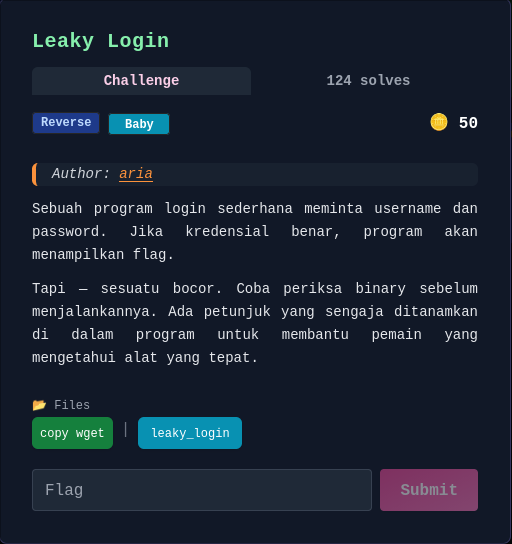
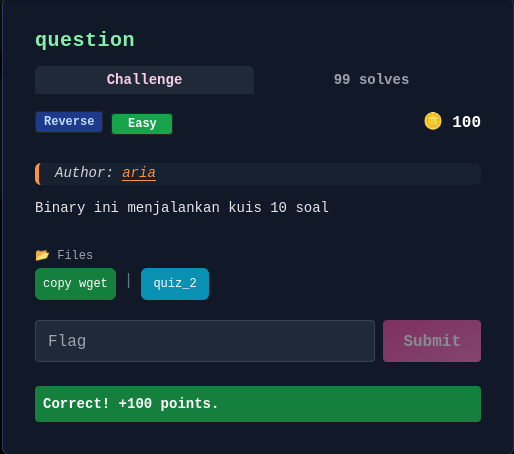
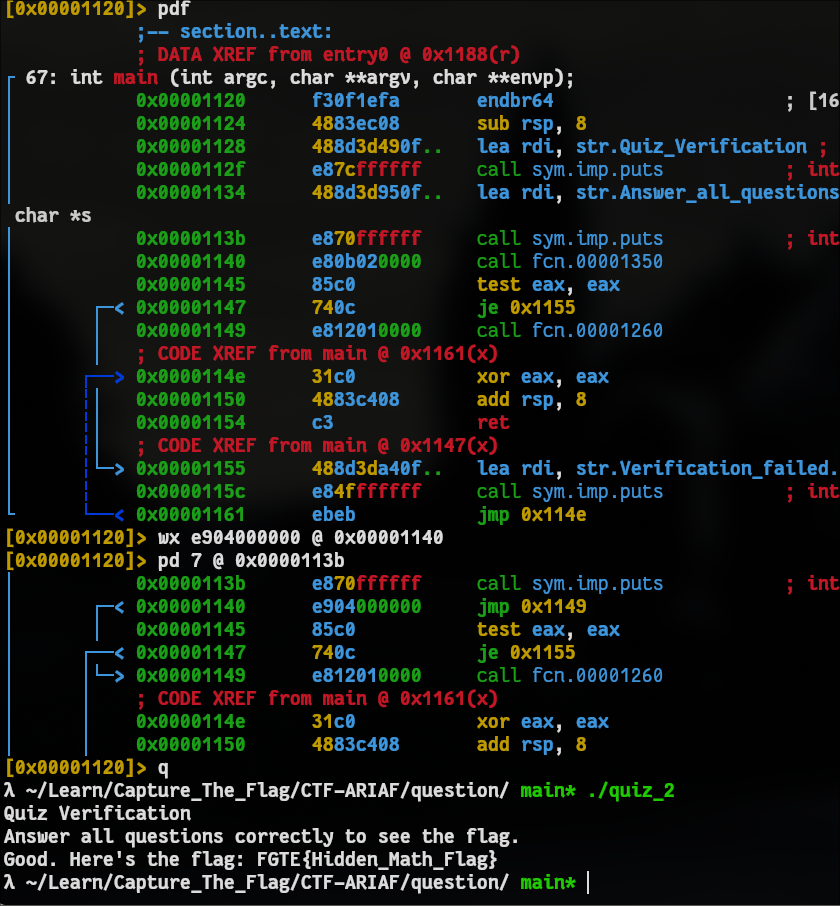

# Write up CTF ARIAF

Saya lagi belajar pwn dan rev bang ijin nulis **write up**


## rev :
- [Leaky Login](#leaky-login) | [Solved]
- [question](#question)
- [Verif Password](#verif-password) | [Solved]
- [Learn Typing](#learn-typing) | [Solved]
- [Checksumd](#checksumd) | [Solved]
- [Silent Checksum](#silent-checksum) | [Solved]
- [Activation](#activation)
- [Dompet Crypto 2011](#dompet-crypto-2011)

### Leaky login

```
λ ~/Leaky_Login/ main* ./leaky_login              
Login
Username: adit
Password: adit
Login failed.

λ ~/Leaky_Login/ main* file leaky_login                         
leaky_login: ELF 64-bit LSB pie executable, x86-64, version 1 (SYSV), dynamically linked, interpreter /lib64/ld-linux-x86-64.so.2, BuildID[sha1]=a9a0577dc79bf017d1d0f7302c5a7c8aaaa4d1b3, for GNU/Linux 3.2.0, not stripped

λ ~/Leaky_Login/ main* strings leaky_login          
/lib64/ld-linux-x86-64.so.2
0,Z|
mfUa
__cxa_finalize
fgets
strcspn
__libc_start_main
strcmp
puts
strstr
strlen
stdin
snprintf
stderr
fwrite
__stack_chk_fail
libc.so.6
GLIBC_2.4
GLIBC_2.2.5
GLIBC_2.34
_ITM_deregisterTMCloneTable
__gmon_start__
_ITM_registerTMCloneTable
PTE1
u+UH
{"user":"admin","pass":"letmein123","flag":"FGTE{REVERSE_LOGIN_LEAK}"}
"%s":"
user
pass
flag
Internal error: bad embedded creds JSON
Login
Username: 
Password: 
Welcome %s!
Flag: %s
Login failed.
:*3$"
GCC: (Ubuntu 11.4.0-1ubuntu1~22.04.2) 11.4.0
Scrt1.o
__abi_tag
crtstuff.c
deregister_tm_clones
__do_global_dtors_aux
completed.0
__do_global_dtors_aux_fini_array_entry
frame_dummy
__frame_dummy_init_array_entry
leaky_login.c
creds_json
extract_value
__FRAME_END__
_DYNAMIC
__GNU_EH_FRAME_HDR
_GLOBAL_OFFSET_TABLE_
__libc_start_main@GLIBC_2.34
_ITM_deregisterTMCloneTable
puts@GLIBC_2.2.5
stdin@GLIBC_2.2.5
_edata
_fini
strlen@GLIBC_2.2.5
__stack_chk_fail@GLIBC_2.4
snprintf@GLIBC_2.2.5
strcspn@GLIBC_2.2.5
fgets@GLIBC_2.2.5
__data_start
strcmp@GLIBC_2.2.5
__gmon_start__
__dso_handle
_IO_stdin_used
_end
__bss_start
main
fwrite@GLIBC_2.2.5
__TMC_END__
_ITM_registerTMCloneTable
__cxa_finalize@GLIBC_2.2.5
_init
strstr@GLIBC_2.2.5
stderr@GLIBC_2.2.5
.symtab
.strtab
.shstrtab
.interp
.note.gnu.property
.note.gnu.build-id
.note.ABI-tag
.gnu.hash
.dynsym
.dynstr
.gnu.version
.gnu.version_r
.rela.dyn
.rela.plt
.init
.plt.got
.plt.sec
.text
.fini
.rodata
.eh_frame_hdr
.eh_frame
.init_array
.fini_array
.dynamic
.data
.bss
.comment

λ ~/Leaky_Login/ main* ./leaky_login
Login
Username: admin
Password: letmein123
Welcome admin!
Flag: FGTE{REVERSE_LOGIN_LEAK}

```
- Cuman saya strings flagnya udah terlihat, mungkin bagi kalian yang gatau apa gunanya perintah strings, jadi perintah itu bisa melihat string yang pastinya wkwk, bisa juga memahami logika berdasarkan output kalo output berupa strings, mengindentifikasi library dan fungsi kalo binarynya ga di strip.
### Flag: FGTE{REVERSE_LOGIN_LEAK}


### question


```
λ ~/question/ main* ./quiz_2     
Quiz Verification
Answer all questions correctly to see the flag.
Welcome to quiz verification. You will be asked 10 questions.
(Seed: 1768824056)
Q1: 14 * 3 = ?
42
Q2: 42 - 9 = ?
33
Q3: 15 % 37 = ?
15
Q4: 80 - 41 = ?
39
Q5: 29 - 34 = ?
-5
Q6: 71 - 14 = ?
57
Q7: 1 + 21 = ?
22
Q8: 33 - 25 = ?
8
Q9: 99 + 20 = ?
119
Q10: 48 - 25 = ?
23
Good. Here's the flag: FGTE{Hidden_Math_Flag}
λ ~/question/ main* 
```
- Okey dari sini emang keluar sih flagnya masa soalnya cuma matematika, nah saya berasumsi kalo soalnya ini harus langsung ngeluarin flag atau di otomasi programnya biar ga perlu ngitung, cape jir bolak balik kalkulator :v. 


- okey program sudah saya patching biar langsung muntahin flag, sekarang saya jelasin apa yang saya lakukan
`wx e904000000 @ 0x00001140`
- Dari 0x1140 lompat ke 0x1149
- kode di bawah ini tidak bakalan dilewatin
```
call fcn.00001350
test eax, eax   
je fail            
```

`pd 7 @ 0x0000113b`
- saya minta tampilkan 7 instruksi dari alamat tersebut
`0x1140  e904000000  jmp 0x1149`
- artinya patching berhasil

```
__int64 __fastcall main(int a1, char **a2, char **a3)
{
  puts("Quiz Verification");
  puts("Answer all questions correctly to see the flag.");
  if ( (unsigned int)sub_1350("Answer all questions correctly to see the flag.", a2) )
    sub_1260();
  else
    puts("Verification failed. Try again.");
  return 0;
}
```
- Masalahnya: **sub_1350()** selalu dieksekusi
- Flag function **sub_1260** dipanggil di luar

```
__int64 __fastcall sub_1350()
{
  __int64 v0; // rbx
  unsigned int v1; // r13d
  char *v2; // rbp
  unsigned int v3; // r12d
  unsigned int v4; // edx
  __int64 v5; // r12
  int v6; // r15d
  int v7; // eax
  int v8; // r8d
  int v9; // ecx
  int v10; // esi
  int v12; // [rsp+4h] [rbp-A4h]
  int v13; // [rsp+8h] [rbp-A0h]
  int v14; // [rsp+Ch] [rbp-9Ch]
  char v15; // [rsp+10h] [rbp-98h] BYREF
  unsigned __int64 v16; // [rsp+68h] [rbp-40h]

  v1 = 1;
  v16 = __readfsqword(0x28u);
  v2 = &v15;
  v3 = time(0);
  srand(v3);
  __printf_chk(1, "Welcome to quiz verification. You will be asked %d questions.\n", 10);
  v4 = v3;
  v5 = 1;
  __printf_chk(1, "(Seed: %u)\n", v4);
  while ( 1 )
  {
    v6 = rand() % 100;
    v14 = v6 + 1;
    v13 = rand() % 50;
    v12 = v13 + 1;
    v7 = rand();
    v8 = v13 + 1;
    v9 = v6 + 1;
    v10 = v7 % 4;
    if ( v7 % 4 == 2 )
    {
      v0 = v12 * (__int64)v14;
      __printf_chk(1, "Q%d: %d * %d = ?\n", v5, v9, v8);
    }
    else if ( v10 == 3 )
    {
      v0 = v14 % v12;
      __printf_chk(1, "Q%d: %d %% %d = ?\n", v5, v9, v8);
    }
    else if ( (v7 & 3) != 0 )
    {
      if ( v10 == 1 )
      {
        v0 = v6 - v13;
        __printf_chk(1, "Q%d: %d - %d = ?\n", v5, v9, v8);
      }
    }
    else
    {
      v0 = v14 + v12;
      __printf_chk(1, "Q%d: %d + %d = ?\n", v5, v9, v8);
    }
    if ( (unsigned int)__isoc99_scanf("%ld", v2) != 1 )
      break;
    if ( *(_QWORD *)v2 != v0 )
      v1 = 0;
    ++v5;
    v2 += 8;
    if ( v5 == 11 )
      return v1;
  }
  return 0;
}
```

di sini program menginisialisasi RNG (srand(seed))
Loop 10 kali:
Ambil input user
Bandingkan jawaban
Jika salah → set status gagal

### Flag: FGTE{Hidden_Math_Flag}
